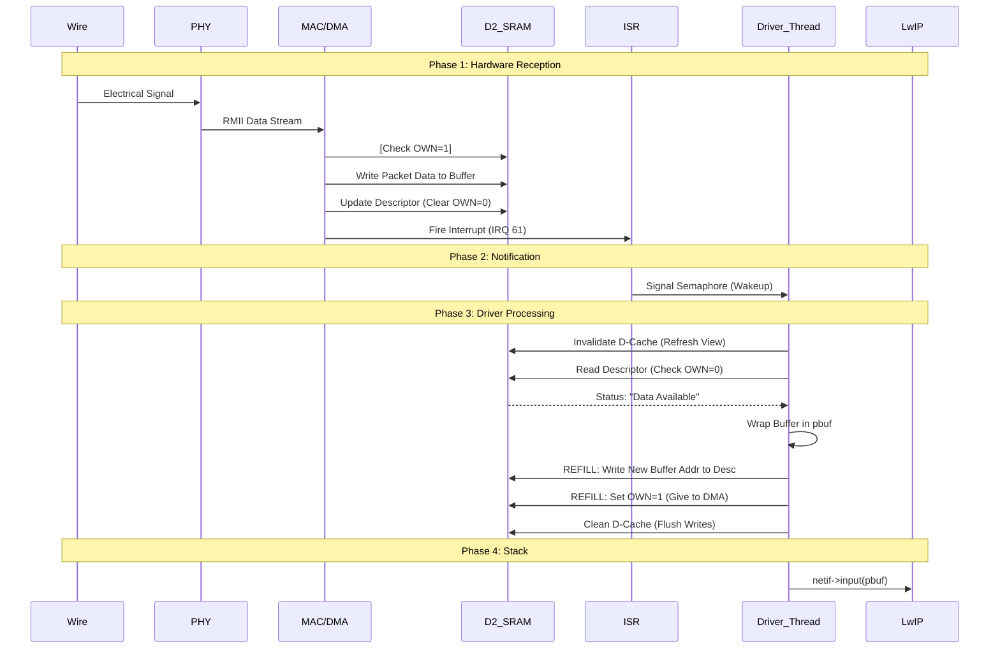
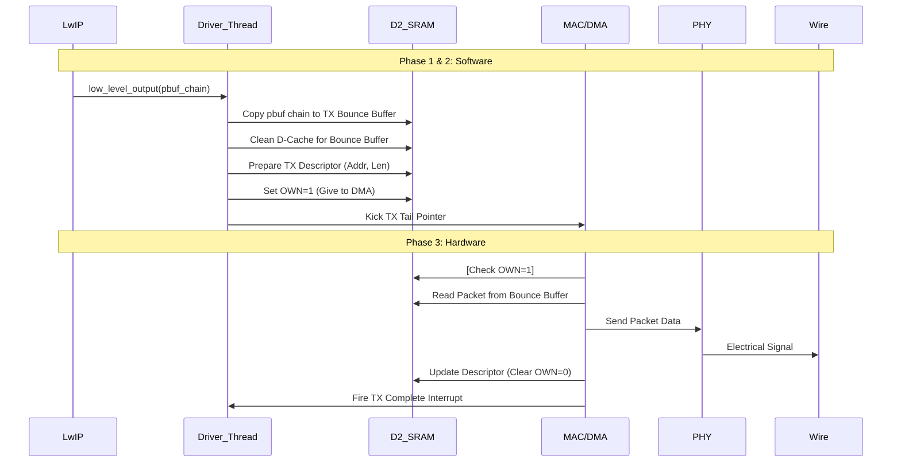

# Programmer's Manual: STM32H7 Ethernet Data Path

## 1. Executive Summary
This document details the lifecycle of an Ethernet packet on the STM32H743ZI Nucleo board running RTEMS and LwIP. It is designed to help developers understand the interaction between the Hardware (MAC/DMA), the Driver (`stm32h7_eth.c`), and the Stack (LwIP).

**Key Architecture Properties:**
-   **Zero-Copy Reception**: The DMA writes directly into LwIP-compatible buffers (`pbuf`). We do not `memcpy` packet data.
-   **Bounce-Copy Transmission**: LwIP packet data is copied to a single, DMA-accessible bounce buffer for transmission.
-   **Manual Descriptor Management**: We bypass the HAL's abstraction layer in critical paths to handle cache coherency and alignment correctly.
-   **Memory Domain**: All Ethernet descriptors and buffers reside in **D2 SRAM** (`0x30000000`).

---

## 2. Key Concepts

### D2 RAM
The STM32H7 uses a "Bus Matrix" architecture where different bus masters (like the CPU or DMA) have varying access to different memory regions. D2 SRAM is a 288 KB region of fast, CPU-local RAM. Crucially, it is directly accessible by the Ethernet DMA, making it the ideal location for communication structures like descriptors and buffers. All Ethernet-related data structures are placed here to ensure the DMA can see them.

### pbuf (Packet Buffer)
A `pbuf` is LwIP's core data structure for handling network packets. It's a metadata structure that points to the actual packet data. In our zero-copy reception scheme, we create a `pbuf_custom` that points directly to the memory location where the DMA has written the packet. This avoids copying the packet data entirely. For transmission, LwIP provides a `pbuf` chain which we copy into a single, contiguous "bounce buffer" before sending.

### Descriptor
The **Descriptor** is the communication message between the DMA and the CPU. It's not the packet data itself; it's a small struct that describes *where* the packet data is and who currently owns it. Both the receiver and transmitter have their own circular array of descriptors.

```c
typedef struct {
  uint32_t DESC0; // Address of the Data Buffer (Pointer)
  uint32_t DESC1; // Reserved/Control
  uint32_t DESC2; // Buffer Length Control
  uint32_t DESC3; // Status & OWN Bit
} ETH_DMADescTypeDef_Shadow;
```
-   **DESC3 Bit 31 (OWN)**:
    -   `1`: "DMA, this is yours. Put a packet here (RX) or send this packet (TX)."
    -   `0`: "CPU, this is yours. I put a packet here (RX) or I finished sending this (TX)."

---

## 3. Hardware Landscape & Memory Map

The Ethernet DMA can only access specific memory regions. We strictly use **D2 SRAM** for all Ethernet structures.

| Region | Address | Size | Usage |
| :--- | :--- | :--- | :--- |
| **RX Descriptors** | `0x30000000` | 256 bytes | The "Checklist" for the DMA. 16 Items. |
| **TX Descriptors** | `0x30000400` | 64 bytes | Queue for outgoing packets. 4 Items. |
| **RX Buffer Pool** | `0x30000600` | ~50KB | Raw memory pool for incoming packet data. |
| **TX Bounce Buffer** | `0x3000D000` | 1536 bytes | Single buffer for staging outgoing packets. |

> [!WARNING]
> **Cache Coherency**: The Cortex-M7 has a data cache (D-Cache). The DMA writes directly to RAM, bypassing the CPU cache. If the CPU reads a cached value of a descriptor instead of the actual RAM value, it will miss packets ("Stale Cache"). We must explicitly `InvalidateDCache` before reading anything touched by DMA and `CleanDCache` before making data available to the DMA.

---

## 4. The Packet Lifecycle (Reception)

### Phase 1: The Wire to Memory (Hardware)
_No software runs during this phase._

1.  **PHY (LAN8742)**: Receives electrical signals, decodes them, and sends a digital stream via **RMII** to the MAC.
2.  **MAC (Ethernet Core)**: Checks CRC and Destination Address. If accepted, it pushes data to the RX FIFO.
3.  **DMA (Direct Memory Access)**:
    *   Reads the current **RX Descriptor** from the circular queue in D2 RAM.
    *   Checks if `OWN` bit (Bit 31) is `1` (DMA Owned).
    *   Reads the buffer pointer (`DESC0`).
    *   **Writes the packet data directly to the buffer in D2 RAM.**
    *   **Updates the Descriptor**: Writes packet length and status to `DESC3`, and **clears the OWN bit** (sets to `0`).
    *   **Triggers Interrupt**: Fires `ETH_IRQn`.

### Phase 2: The Notification (Interrupt)
_Implementation: `rtemslwip/stm32h7/stm32h7_eth.c`_

4.  **ISR (`stm32h7_eth_interrupt_handler`)**:
    *   Clears the interrupt flags.
    *   **Action**: Wakes up the `ethernetif_input` thread by signaling a semaphore (`RxPktSemaphore`).

### Phase 3: The Driver (Thread)
_Implementation: `ethernetif_input` -> `low_level_input`_

5.  **Thread Wakeup**: The `ethernetif_input` thread unblocks from the semaphore.
6.  **Scan for Packets (`low_level_input`)**:
    *   **Look at Index**: We check `DMARxDscrTab[RxDescIdx]`. `RxDescIdx` is the index of the next descriptor to be processed by the CPU.
    *   **Cache Invalidate**: `SCB_InvalidateDCache_by_Addr`. **CRITICAL**. Forces the CPU to read the descriptor's true state from RAM.
    *   **Check OWN Bit**: If `Bit 31 == 0`, the CPU owns it and it contains data.
7.  **Packet Processing (Circular Queue Fix)**:
    *   Extract Length from `DESC3`.
    *   **Wrap in PBUF**: Create a `pbuf` struct that points to the received data. An offset of `+2` bytes is used to ensure the IP header is 32-bit aligned.
    *   **Refill (Hot Swap)**:
        *   Allocate a new buffer from the pool for the just-used descriptor.
        *   Write the new buffer's address to `DESC0`.
        *   Set `OWN=1` (Give back to DMA).
        *   `SCB_CleanDCache`: Flush our writes to RAM.
    *   **Tail Pointer Kick**: The `DMACRDTPR` (DMA Channel Rx Descriptor Tail Pointer Register) must be updated. **The fix**: in ring mode, this register must point *after* the last descriptor in the ring to ensure the DMA processes the entire circle. The driver now correctly updates this pointer.

### Phase 4: The Stack (LwIP)
8.  **Handover**: `low_level_input` returns the `pbuf *`.
9.  **LwIP Processing**: The driver calls `netif->input(p, netif)`, which passes the packet up the stack for IP/TCP/UDP processing.

---

## 5. The Packet Lifecycle (Transmission)

### Phase 1: The Stack to Driver (LwIP)
1.  **Application Call**: User code calls an LwIP function to send data (e.g., `net_conn_write`).
2.  **LwIP Prepares Packet**: LwIP moves through the TCP/IP layers, adding the necessary headers (TCP, IP, Ethernet). It creates a `pbuf` chain to hold the packet.
3.  **Handover**: LwIP calls the driver's `low_level_output` function, passing the `pbuf` chain.

### Phase 2: The Driver (Thread)
_Implementation: `low_level_output`_

4.  **Flatten and Copy**: The `pbuf` chain may be fragmented. The driver iterates through the chain and copies the data into a single, contiguous **TX Bounce Buffer** located in D2 RAM (`0x3000D000`).
5.  **Prepare Descriptor**:
    *   The driver selects the next available TX descriptor from its circular queue (`DMATxDscrTab`).
    *   It writes the address of the bounce buffer into `DESC0`.
    *   It writes the packet length into `DESC2`.
    *   **Cache Clean**: `SCB_CleanDCache_by_Addr` is called on the bounce buffer to ensure the DMA reads the correct packet data from RAM.
6.  **Handover to DMA**:
    *   The driver sets the `OWN` bit to `1` in `DESC3`, giving the descriptor to the DMA.
    *   It then "kicks" the transmitter by writing to the `DMACTDTPR` (tail pointer) register, signaling that a new packet is ready.

### Phase 3: Memory to Wire (Hardware)
_No software runs during this phase._

7.  **DMA (Direct Memory Access)**:
    *   Reads the **TX Descriptor**.
    *   Checks if `OWN` bit is `1`.
    *   Reads the buffer pointer (`DESC0`) which points to our bounce buffer.
    *   **Reads the packet data from the bounce buffer.**
    *   Sends the data to the MAC's TX FIFO.
8.  **MAC (Ethernet Core)**: Adds the preamble and CRC, and sends the data to the PHY.
9.  **PHY (LAN8742)**: Encodes the digital stream into electrical signals and sends them out on the wire.
10. **DMA Post-Processing**: After transmission, the DMA clears the `OWN` bit in the descriptor and triggers an interrupt (`HAL_ETH_TxCpltCallback`) to signal completion.

---

## 6. Visual Flow Diagrams

### Reception


### Transmission


---

## 7. Cheatsheet for Debugging

| Symptom | Probable Cause | Fix |
| :--- | :--- | :--- |
| **Crash immediately on reception** | Unaligned Access (IP Header) | Verify `ETH_PAD_SIZE=2` logic. Check `SCB->CCR` trap. |
| **"Receive Buffer Unavailable"** | Driver too slow / Descriptor Ring full | Increase `ETH_RX_DESC_CNT`. Ensure `DMACRDTPR` is kicked correctly. |
| **No "RX" logs, but IRQs firing** | Cache mismatch. CPU thinks desc is empty. | Check `SCB_InvalidateDCache_by_Addr` in read loop. |
| **Ping works, but large data fails** | MPU Configuration or TX Bounce Buffer issue | Ensure D2 SRAM regions are configured correctly. Check for buffer overflows. |
| **Transmission stalls** | Cache mismatch on TX buffer or descriptor | Verify `SCB_CleanDCache_by_Addr` is called before handing buffer to DMA. |
| **No TX complete interrupts** | Incorrect descriptor setup or IRQ issue | Ensure `OWN` bit is set correctly and TX interrupts are enabled. |

### RBU (Receive Buffer Unavailable)
If the DMA fills all the buffers pointed to by the descriptors it owns before the software can process them, it hits a wall.
*   It sets `RBU` error flag.
*   It enters **Suspend** state.
*   **Fix**: The driver must detect `RBU`, clear the flag, and write to `DMACRDTPR` (Tail Pointer) to tell the DMA to wake up and check the descriptors again.

---

## 8. Building and Testing

This section details how to build the project and verify its functionality using the provided test tools.

### 8.1 Build Instructions

The project uses the `waf` build system.

**1. Prerequisites**
Ensure git submodules are initialized:
```bash
git submodule init
git submodule update
```

**2. Configure**
Run the configuration command. You must specify the RTEMS BSP and installation path.

> **Note**: In the UTN development environment, the RTEMS path is typically `/opt/rtems/6.1`.

```bash
./waf configure --rtems-bsps=arm/nucleo-h743zi --rtems=<RTEMS_PATH> --rtems-version=6
```

*Example for UTN environment:*
```bash
./waf configure --rtems-bsps=arm/nucleo-h743zi --rtems=/opt/rtems/6.1 --rtems-version=6
```

**3. Build**
Compile the project:
```bash
./waf
```

**4. Output**
The test application binary will be generated at:
`build/arm-rtems6-nucleo-h743zi/stm32h7_test.exe`

### 8.2 Testing & Verification

To verify the network stack, we use a specific test application running on the board and a python regression script running on a host Linux machine.

#### Network Setup
The test application is hardcoded with the following network settings:
*   **Board IP**: `192.168.1.10`
*   **Netmask**: `255.255.255.0`
*   **Gateway**: `192.168.1.1`

**Host Machine Configuration**:
Your host machine must be on the same subnet (e.g., `192.168.1.x`). You may need to manually configure your Ethernet interface.

*Example Linux command to set host IP to 192.168.1.20:*
```bash
# Replace eth0 with your actual interface name (e.g., enp3s0, eth1)
sudo ip addr add 192.168.1.20/24 dev eth0
```

#### Running the Test App (`stm32h7_test.exe`)
1.  **Flash** the `stm32h7_test.exe` binary to the Nucleo board.
2.  **Connect** to the serial console (115200 baud).
3.  **Reset** the board.

**Expected Serial Output**:
```text
*** STM32H7 LWIP TEST ***
Waiting for Ethernet link to come up...
Interface is UP. IP: 192.168.1.10
Starting lwiperf server on port 5001...
HB: IRQs=... Rx=...
```
The "HB" (Heartbeat) line indicates the application is running and the main loop is active.

#### Automated Regression Testing
We provide a Python script to automate validation. This script performs:
*   **UDP Echo Tests**: Verifies data integrity, especially for small/unaligned packets which are critical for this driver.
*   **ICMP Ping**: Checks basic connectivity.
*   **Iperf Throughput**: Checks TCP performance (requires `iperf` installed on host).

**Script Location**: `test/regression_test.py`

**Running the Test**:
From the root of the repository on your host machine:

```bash
python3 test/regression_test.py --board-ip 192.168.1.10
```

**Successful Output**:
You should see a series of PASS messages:
```text
[PASS] UDP-Tiny-1: "A" → "A" (2ms)
...
[PASS] Ping-Basic: 5/5 packets...
[PASS] iperf-RX: 2.16 Mbps
...
Status: ✅ ALL TESTS PASSED
```
