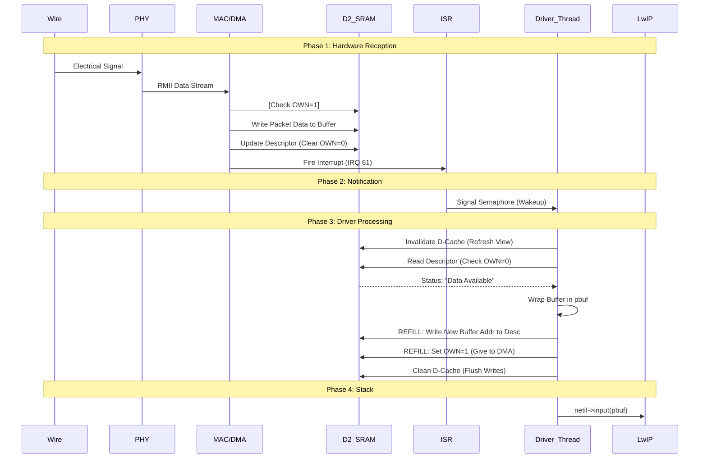

# Programmer's Manual: STM32H7 Ethernet Data Path

## 1. Executive Summary
This document details the lifecycle of an Ethernet packet on the STM32H743ZI Nucleo board running RTEMS and LwIP. It is designed to help developers understand the interaction between the Hardware (MAC/DMA), the Driver (`stm32h7_eth.c`), and the Stack (LwIP).

**Key Architecture Properties:**
-   **Zero-Copy Reception**: The DMA writes directly into LwIP-compatible buffers (`pbuf`). We do not `memcpy` packet data.
-   **Manual Descriptor Management**: We bypass the HAL's abstraction layer in critical paths to handle cache coherency and alignment correctly.
-   **Memory Domain**: All Ethernet descriptors and buffers reside in **D2 SRAM** (`0x30000000`).

---

## 2. Hardware Landscape & Memory Map

The STM32H7 uses a "Bus Matrix" architecture. The Ethernet DMA cannot easily access all memory regions. We strictly use **D2 SRAM** for all Ethernet structures.

| Region | Address | Size | Usage |
| :--- | :--- | :--- | :--- |
| **RX Descriptors** | `0x30000000` | ~192 bytes | The "Checklist" for the DMA. 12 Items. |
| **TX Descriptors** | `0x30000400` | ~64 bytes | Queue for outgoing packets. |
| **RX Buffer Pool** | `0x30000600` | ~50KB | Raw memory pool for packet data. |

> [!WARNING]
> **Cache Coherency**: The Cortex-M7 has a data cache (D-Cache). The DMA writes directly to RAM, bypassing the CPU cache. If the CPU reads a cached value of a descriptor instead of the actual RAM value, it will miss packets ("Stale Cache"). We must explicitly `InvalidateDCache` before reading anything touched by DMA.

---

## 3. The Packet Lifecycle (Step-by-Step)

### Phase 1: The Wire to Memory (Hardware)
_No software runs during this phase._

1.  **PHY (LAN8742)**: Receives differential signals on the RJ45 port. Decodes them and sends digital signals via **RMII** interface to the MAC.
2.  **MAC (Ethernet Core)**: Checks the Preamble, CRC, and Destination Address (Filtering). If accepted, it pushes data to the RX FIFO.
3.  **DMA (Direct Memory Access)**:
    *   Reads the current **RX Descriptor** from RAM (`0x30000000` + offset).
    *   Checks if `OWN` bit (Bit 31) is `1` (DMA Owned).
    *   Reads the buffer pointer (`DESC0`).
    *   **Writes the packet data directly to the buffer in RAM.**
    *   **Updates the Descriptor**: Writes packet length and status to `DESC3`, and **clears the OWN bit** (sets it to `0`).
    *   **Triggers Interrupt**: Fires `ETH_IRQn` (Vector 61).

### Phase 2: The Notification (Interrupt)
_Implementation: `rtemslwip/stm32h7/stm32h7_eth.c`_

4.  **ISR (`stm32h7_eth_interrupt_handler`)**:
    *   The CPU jumps to the interrupt vector.
    *   We clear the interrupt flags.
    *   **Action**: We `sys_sem_signal(&RxPktSemaphore)`.
    *   *Note*: We do NOT process packets here. We just wake up the thread. Keep the ISR short.

### Phase 3: The Driver (Thread)
_Implementation: `ethernetif_input` -> `low_level_input`_

5.  **Thread Wakeup**: The `ethernetif_input` thread was blocking on the semaphore. It wakes up.
6.  **Scan for Packets (`low_level_input`)**:
    *   **Look at Index**: We check `DMARxDscrTab[RxDescIdx]`.
    *   **Cache Invalidate**: `SCB_InvalidateDCache_by_Addr`. **CRITICAL**. This forces the CPU to discard its cached "Empty" view and fetch the "Full" status from RAM.
    *   **Check OWN Bit**:
        *   `Bit 31 == 1`: DMA still owns it. False alarm or burst finished. Stop.
        *   `Bit 31 == 0`: **CPU Owns it. We have data.**
7.  **Packet Processing**:
    *   Extract Length from `DESC3`.
    *   **Wrap in PBUF**: We calculate the buffer address. We create a `pbuf` struct that looks at this memory.
        *   *Offset Fix*: We add `+2` bytes to the pointer so the IP Header (14 bytes in) lands on a 16-byte aligned address.
    *   **Refill (Hot Swap)**:
        *   We cannot leave the descriptor empty. The DMA needs a place for the next packet.
        *   We determine a NEW buffer address from the pool.
        *   We write the NEW address to `DESC0`.
        *   We set `OWN=1` (Give back to DMA).
        *   `SCB_CleanDCache`: Flush our writes to RAM.
        *   `Tail Pointer Kick`: Tell DMA "Hey, I updated the list."

### Phase 4: The Stack (LwIP)
_Implementation: `lwip/src/netif/ethernet.c`_

8.  **Handover**: `low_level_input` returns the `pbuf *`.
9.  **LwIP Processing**: The driver calls `netif->input(p, netif)`.
    *   Ethernet Header removed.
    *   IP Header checked.
    *   TCP/UDP processing.
    *   Application (User code) receives data.

---

## 4. Visual Flow Diagram



---

## 5. Key Implementation Concepts

### The Descriptor ("The Metadata")
The **Descriptor** is the communication message between DMA and CPU. It's not the packet data itself; it's a struct describing *where* the data is.

```c
typedef struct {
  uint32_t DESC0; // Address of the Data Buffer (Pointer)
  uint32_t DESC1; // Reserved
  uint32_t DESC2; // Buffer Length Control
  uint32_t DESC3; // Status & OWN Bit
} ETH_DMADescTypeDef_Shadow;
```
*   **DESC3 Bit 31 (OWN)**:
    *   `1`: "DMA, this is yours. Put a packet here."
    *   `0`: "CPU, this is yours. I put a packet here."

### The Buffer ("The Payload")
We use `ETH_PAD_SIZE = 2`.
*   Standard Ethernet Header: 14 Bytes.
*   If we start at offset 0: IP Header starts at 14. **(Not Aligned -> CRASH)**.
*   We start at offset 2: Ethernet Header at 2..16. IP Header starts at 16. **(Aligned -> SUCCESS)**.

### RBU (Receive Buffer Unavailable)
If the DMA fills all 12 Descriptors before the Software reads them, it hits a wall.
*   It sets `RBU` error flag.
*   It enters **Suspend** state.
*   **Fix**: The driver must detect `RBU`, clear the flag, and write to `DMACRDTPR` (Tail Pointer) to tell the DMA to wake up and check the descriptors again.

---

## 6. Cheatsheet for Debugging

| Symptom | Probable Cause | Fix |
| :--- | :--- | :--- |
| **Crash immediately on reception** | Unaligned Access (IP Header) | Verify `ETH_PAD_SIZE=2` logic. Check `SCB->CCR` trap. |
| **"Receive Buffer Unavailable"** | Driver too slow / Descriptor Ring full | Increase `ETH_RX_DESC_CNT`. Optimize loops. |
| **No "RX" logs, but IRQs firing** | Cache mismatch. CPU thinks desc is empty. | Check `SCB_InvalidateDCache_by_Addr` in read loop. |
| **Ping works, but large data fails** | MPU Configuration | Ensure D2 SRAM regions are not "Device" type if executing code, or "Normal" type for buffers. |

